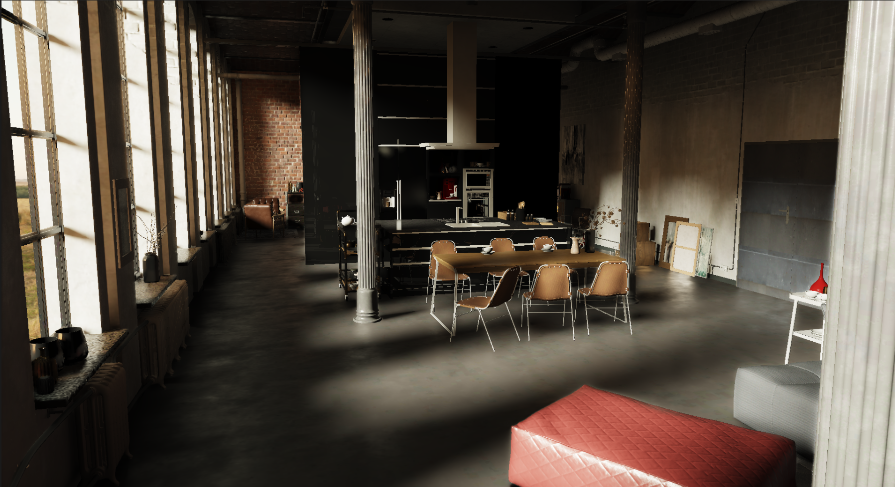

# Soul
Vulkan Rendering Engine

Implemented feature:
- RenderGraph: Automatic GPU-CPU and GPU-GPU synchronization. RenderGraph will track dependencies between render pass and insert the require memory and execution barrier.
- Custom std library with rust philosophy in mind.
- Custom memory allocator like linear allocator, pool allocator and proxy allocator.
- Job system with Chales-Lev work stealing deque.
- Hybrid rendering pipeline with ray traced AO, shadow and reflection denoised with SVGF. DDGI is used for global illumination.

Video Demo:
https://www.youtube.com/watch?v=qsXRj9AflO4

Screenshots:

